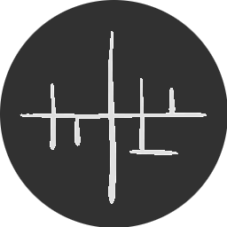

  <table>
    <tr>
      <td vlign="center">
        
      </td>
      <td vlign="center">
        <h3 align="left">Hi there 👋, I'm lossdev</h3>
      </td>
    </tr>
  </table>

   

 
  
Some stuff I enjoy:

  
👨‍💻 Software Engineering

  
🐳 Containerization

  
☸️ Kubernetes / Helm

  
📈 DevOps

  
🔐 Cybersecurity

   
  
🌐 Check out my new portfolio website: https://loss.dev

  
✉️ Contact me by email <a href="mailto:lossdev@loss.dev">here!</a>

  
👇 Check out my public repositories below! <a href="mailto:lossdev@loss.dev">Contact me</a> for more information on currently private projects and work not shown here

<!--
**lossdev/lossdev** is a ✨ _special_ ✨ repository because its `README.md` (this file) appears on your GitHub profile.

Here are some ideas to get you started:

- 🔭 I’m currently working on ...
- 🌱 I’m currently learning ...
- 👯 I’m looking to collaborate on ...
- 🤔 I’m looking for help with ...
- 💬 Ask me about ...
- 📫 How to reach me: ...
- 😄 Pronouns: ...
- ⚡ Fun fact: ...
-->
